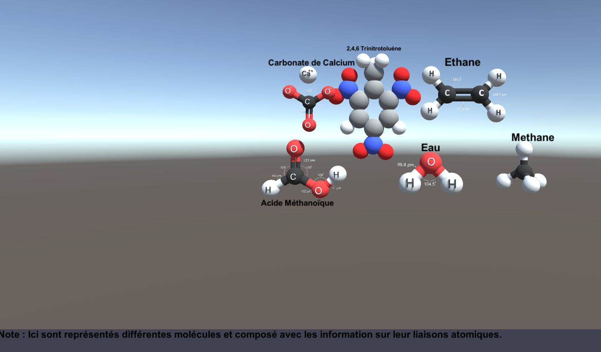

# AR Learning – Système de Réalité Augmentée pour l'Éducation

## 📌 Description
AR Learning est une **application en réalité augmentée** visant à **simplifier l’apprentissage** de matières scientifiques complexes comme l’informatique quantique, la chimie organique et la biologie.

## 🚀 Fonctionnalités
- Visualisation interactive de concepts scientifiques
- Modules thématiques : physique, chimie, biologie
- Interaction en réalité augmentée avec modèles 3D

## 🛠 Technologies
- Unity
- Felgo (framework AR multiplateforme)

## Apercu
